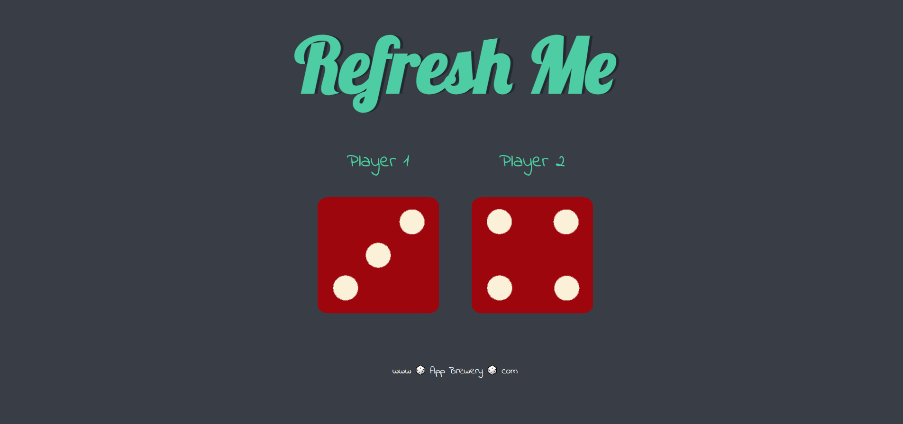

#Web Development - DICE CHALLENGE
This is a basic dice game everybody can do at home :)
## Table of contents

- [Overview](#overview)
  - [The challenge](#the-challenge)
  - [Screenshot](#screenshot)
  - [Links](#links)
- [My process](#my-process)
  - [Built with](#built-with)
  - [What I learned](#what-i-learned)
  - [Continued development](#continued-development)
- [Author](#author)

## Overview
Hello Everyone! I'm new to JavaScript. This assignment given me by Dr.Angela YU.
### The challenge

The challenge aims you to design a basic dice game by using DOM.

### Screenshot


### Links
https://bekirkutluhan.github.io/Dice-Challenge/
## My process
I firstly tried to understand how to control methods such as onclick, then i wrote whole code.
### Built with

- Semantic HTML5 markup
- Bootstrap
- JavaScript

### What I learned

This challenge is super educational for DOM .

To see how you can add code snippets, see below:

```html
<!-- COL-CIRCLE -->
<div class="col-lg-4 ">
  <i class="fas fa-bullseye  color-red fa-4x"></i><br>
  <h3 class="Mont">Elite Clientele</h3>
  <p id="paragraphs1">We have all the dogs, the <br>greatest dogs.</p>
</div>
```

```CSS
@media screen and (max-width:900px){
   #tindogimg{
     margin-top: 50px;
     width: 30%;
     transform: rotate(0);
   }
 #title{
     background-color: #ff4c68;
   }
```
var dice1;
var dice2;
document.querySelector(".container h1").onclick = rollTheDices;

function rollTheDices(){
  dice1= Math.floor(((Math.random()*6)+1));
  dice2=Math.floor(((Math.random()*6)+1));

  var diceImage1 = "images/dice"+dice1+".png";
  var diceImage2 = "images/dice"+dice2+".png";

  document.querySelector(".img1").setAttribute("src",diceImage1);
  document.querySelector(".img2").setAttribute("src",diceImage2);
}

### Continued development

I still need to learn a lot. Please contact me if you think i did something wrong or weak or mine is worse than yours.

## Author

-My Linkedin-https://www.linkedin.com/in/bekir-kutluhan-co%C5%9Fkun-6b63b8146/
- Frontend Mentor- https://www.frontendmentor.io/profile/BekirKutluhan
